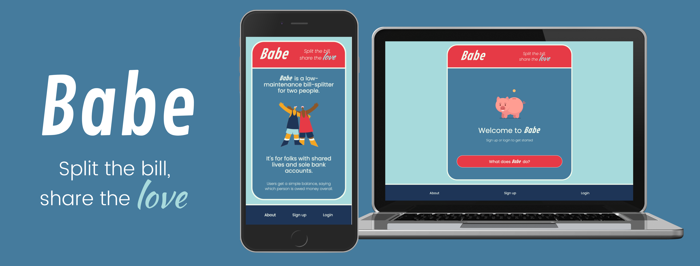
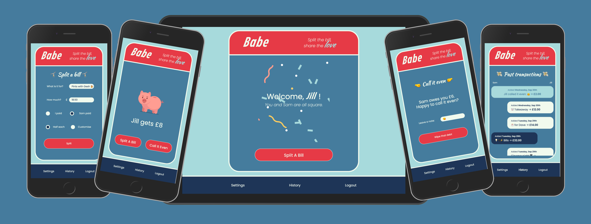

# Babe: Fast, unfussy bill-splitting for couples


<p align="center">
  
</p>

Babe is a responsive web app for couples who want shared lives and separate bank accounts.

## Table of Contents

- [Features](#Features)

- [Walkthrough](#Walkthrough)

- [Getting started](#Getting-started)

- [Tech stack](#Tech-stack)

- [Contributors](#Contributors)

- [License](#License)

## Features

Babe is a radically simplified version of Splitwise/Venmo designed for two people.

- Invoicing your partner feels so unromantic. So Babe abstracts away the finicky details, letting you keep track of your shared spending with less fuss about the details and no upfront requests for repayment.
- It has a simple interface that lets you add and manage bills, settle up debts, or 'call it even' with your partner. Everything can be done with just a few clicks, with easy customisability.

## Walkthrough

<p align="center">
  
</p>

Babe was developed by [Jill Masters](https://github.com/jillmasters) as a solo project for the coding bootcamp [Codeworks](https://codeworks.me/).

You can watch the intial presentation of the project, after six days of development, below:

<p align="center">
<a href="https://www.loom.com/share/74a62ee9311e46fcb2d2cb2e800ee0a6"></a>
</p>

## Getting started

These instruction will help you setup a local development instance of the app.

#### Setup prerequisites

```bash
git clone https://github.com/jillmasters/babe
cd babe
npm i
```

#### Run the app

From the root folder of the project:

```bash
cd server && npm run dev
cd ../client && npm start
```

## Tech stack

### Front-end

- [Typescript](https://www.typescriptlang.org/)
- [Reactjs](https://reactjs.org)
- [Emotion](https://emotion.sh/)

### Back-end

- [Node.js](https://nodejs.org/)
- [Express](https://expressjs.com)
- [MongoDB](https://www.mongodb.com)
- [Mongoose](https://mongoosejs.com)
- [JWT](https://jwt.io/)

## Contributors

- Jill Masters — [GitHub](https://github.com/jillmasters) — [LinkedIn](https://www.linkedin.com/in/jillchuahmasters/)
- Hamish Chan — [Github](https://github.com/ilyadusoleil) — [LinkedIn](https://www.linkedin.com/in/hamish-chan/)
- Chris Perry — [GitHub](https://github.com/chrisperry-sd) — [LinkedIn](https://www.linkedin.com/in/chrisdperry-sd/)

## License

This project is licensed under the MIT License.
